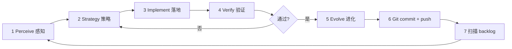
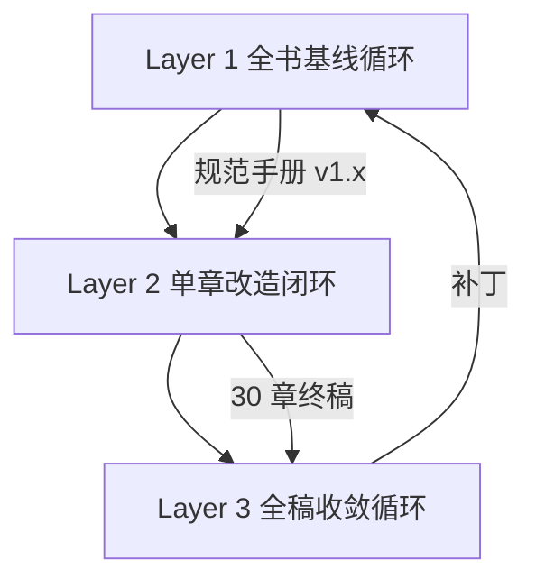

# AGENTS.md

> **Cloud Agent 操作手册** — 本仓库以 [Karpathy autoresearch](https://github.com/karpathy/autoresearch) 模式持续自我改进：**固定 harness 打分 → Agent 改可变面 → git 保留/回滚 → 写回契约 → 下一轮**。本文是单一真相源；细节协议见 [`program_books.md`](program_books.md)，CLI 见 [`loops/README.md`](loops/README.md)。

## 目录

1. [仓库使命与双轨目标](#1-仓库使命与双轨目标)
2. [统一闭环框架 PSIVE + Git](#2-统一闭环框架-psive--git)
3. [仓库地图与职责边界](#3-仓库地图与职责边界)
4. [Loops 自动化 · 规范化 · 提效（Harness 轨）](#4-loops-自动化--规范化--提效harness-轨)
5. [Book Loop 书稿迭代（内容轨）](#5-book-loop-书稿迭代内容轨)
6. [每轮 Git 闭环](#6-每轮-git-闭环)
7. [单轮检查清单](#7-单轮检查清单)
8. [工具索引](#8-工具索引)
9. [当前轮次笔记](#9-当前轮次笔记)
10. [环境与 Gotchas](#10-环境与-gotchas)

（§5.5 [目录迭代](#55-目录迭代agent-可改--内容不足时必用) · §5.6 [全书风格工程化三层循环](#56-全书风格工程化三层迭代循环)）

---

## 1. 仓库使命与双轨目标

### 1.1 使命

**整个 repo 没有「做完就停」** — 持续优化两类产出：

| 轨 | 可变面 | 固定 harness | 主指标 | 协议 |
|----|--------|--------------|--------|------|
| **内容轨** Book | `books/build/chapters/*.tex`、bib、research | `book_prepare.py` + `book-loop` | `quality_score`、Fregly-ready | [`program_books.md`](program_books.md) |
| **Harness 轨** Loops | `loops/iterate.py`、`*_tools.py`、agent_tasks | 现有 step 仍绿 + 回归不破坏书稿 | 单轮耗时 ↓、任务噪声 ↓、自动化覆盖 ↑ | 本文 §4 + 用户点名 |

两轨**共用**同一 PSIVE 闭环与 Git 协议（§2、§6）。每轮只攻**一个主攻点**（一章 **或** 一项 harness 改进），避免混做导致无法归因。

### 1.2 North stars

| 层级 | 标准 |
|------|------|
| **书稿终态** | **30** 章 **Fregly-ready**（非仅 `chapter_ready`）；Part VIII = runtime + 推理框架 + YiRage 协同 |
| **样章对照** | [`reference-chapter-1.pdf`](reference-chapter-1.pdf) — mechanical sympathy、goodput、profile-first、**Key Takeaways → Conclusion** |
| **文风契约** | [`books/WRITING_STYLE.md`](books/WRITING_STYLE.md) §I–§VIII，§七 Fregly 映射；**风格生产流程**见本文 §5.6 |
| **Harness 终态** | Agent 少猜、少重复劳动：`book-loop` 一步产出完整 `agent_tasks` + 可复现 gate；协议单源、路径一致 |

### 1.3 默认行为

- 用户未喊停 → **验证通过 → commit → push → 立即 Loop R{n+1}**
- **不要**新建「一键跑完全阶段」mega-orchestrator，除非用户明确要求
- 优先 **扩展现有 `book-loop` / `iterate.py` / agent_tasks**，而非平行脚本

---

## 2. 统一闭环框架 PSIVE + Git



### 核心原则

| 原则 | 含义 |
|------|------|
| **Harness 先行** | 没有 `compile_ok`、coverage、事实 JSONL，不写新数字、不宣称 ready |
| **单点突破** | 每轮 1 章 **或** 1 项 harness；禁止同轮混改 unrelated 面 |
| **证据链** | `make.sh` + `book_prepare` + fact/citation 报告通过后再改契约文档 |
| **最小 diff** | 匹配现有命名与结构；不 over-engineer 辅助脚本 |
| **验证后沉淀** | 结论写入 `AGENTS.md` / `WRITING_STYLE.md` / `program_books.md` 后再 commit |
| **每轮 commit + push** | push 成功 → 扫描 backlog → 自动下一轮（用户喊停除外） |
| **评分冻结** | loop 期间不改 `book_prepare.py` **权重**；**可**扩/改 `OUTLINE` 与目录 spec |
| **目录可迭代** | 内容不够、结构不合理、spec 与正文不对齐时，**Agent 可改目录**（见 §5.5）；须三层同步 |
| **保护深度章** | `AGENT_SKIP` 章禁 batch；用 `deep-rewrite` + 手改 |

### 终止条件（仅此停止）

- 用户明确停止（「停」「不要 push」等）
- 验证失败且合理修复后仍失败（**不 commit / 不 push**）
- push 连续失败（重试一次后仍失败）
- 纯只读/评审任务

**不因 27/27 `chapter_ready` 停表** — 继续 Fregly 深度与 harness 提效。

### 策略分流（每轮必选其一）

```
uv run book-loop status
```

| 信号 | 轨 | 动作 |
|------|-----|------|
| 未 ready / compile 失败 / fact 失败 | 内容 | `book-loop step` 或 `deep-rewrite` |
| 已 ready 但 `Chapter Summary` / 模板污染 | 内容 | Fregly 章末迁移 + 手改 |
| **内容不够 / 目录与正文脱节** | 内容 | **改目录**（§5.5）→ 再写/扩章 |
| `quality_score` < 85 核心章 | 内容 | `deep-rewrite` + brief；必要时 **增删 `\section` 或调整 OUTLINE** |
| Agent 重复劳动、路径/doc 漂移、task 噪声 | Harness | 改 `iterate.py` / agent_tasks / README 对齐 |
| 新 gate 可机器化（lint、rg 规则） | Harness | 并入 `build_agent_tasks` 或 evaluate，**不改权重** |

---

## 3. 仓库地图与职责边界

| 路径 | 角色 | Agent 可改 | 冻结 / 慎改 |
|------|------|------------|-------------|
| [`loops/iterate.py`](loops/iterate.py) | **主 orchestrator** | harness 逻辑、agent_tasks、CLI | 保持 step 语义稳定 |
| [`book_prepare.py`](book_prepare.py) | 评分 harness | **仅 `OUTLINE`** | 权重、`word_score`、compile 逻辑 |
| [`book_loop.py`](book_loop.py) | CLI shim |  rarely | — |
| `books/build/chapters/*.tex` | **正文主路径** |  prose / structure | 模板 infra |
| [`book_content.md`](book_content.md) | 中文目录 spec（**intent 源**） | **增删改章/节、模块划分、写作意图** | 改后必须同步 OUTLINE + tex |
| [`deps/YiRage`](deps/YiRage) | **YiRage 上游子模块**（runtime/compiler 工程锚点） | pin 版本、文档引用路径 | 勿手改 vendor 树（在 upstream 改） |
| [`deps/`](deps/) | **编译器 + DeepSeek 推理基建子模块** | pin SHA、ch14–19 / ch23–24 对照 | 见 [`deps/README.md`](deps/README.md)；**完整 DeepSeek 推理引擎未开源** |
| [`deps/README.md`](deps/README.md) | 子模块 init / build 说明 | 随 submodule 流程更新 | — |
| `books/research/<id>/` | 研究 + `verified_facts.jsonl` | 核验日志 | 捏造 URL |
| `books/visuals/<id>/` | 图表 plan + generated | plan / snippets | — |
| [`research_tools.py`](research_tools.py) | 文献检索 | 用户点名修 harness | loop 中默认不动 |
| [`book_visuals.py`](book_visuals.py) | 图表管线 | 用户点名 | loop 中默认不动 |
| [`fact_verify.py`](fact_verify.py) | 事实 gate | 用户点名 | loop 中默认不动 |
| [`book_agent_rewrite.py`](book_agent_rewrite.py) | batch 重写 | `AGENT_SKIP` 集 | 勿覆盖 skip 章 |
| [`book_results.tsv`](book_results.tsv) | 实验日志 | append keep/discard | 勿删历史 |
| [`loops/loop_state.json`](loops/loop_state.json) | 上轮 tasks / eval | 本地读写 | gitignore |
| `books/settings.tex` 等 | LaTeX 基础设施 | **禁止** | 模板 |

**路径易错：** 正文在 **`books/build/chapters/`**（非 `books/chapters/`）。`FACT_VERIFICATION.md` 已并入 `WRITING_STYLE.md` §八。

---

## 4. Loops 自动化 · 规范化 · 提效（Harness 轨）

> 目标：让 **每一轮 Agent 时间花在不可替代的 prose/判断上**，机器段可重复、可审计、文档一致。

### 4.1 规范契约（改 harness 时必须保持）

|  artifact | 规范 |
|-----------|------|
| **`loop_state.json`** | 每 step 写入：`chapter_id`、`actions[]`、`agent_tasks[]`、`evaluation`、`errors[]`；Agent **先读 tasks 再动笔** |
| **`book_results.tsv`** | 表头 `commit\tcoverage_pct\tword_count\tcitations\tquality_score\tstatus\tdescription`；`status ∈ {keep,discard,crash}` |
| **`agent_tasks`** | 动词开头、可执行、单条可验收；禁 vague「提高质量」 |
| **CLI** | 入口仅 `uv run book-loop <cmd>`（`status` / `step` / `run` / `deep-rewrite` / `insert-visuals`） |
| **文档单源** | 行为以 `program_books.md` 为准；操作摘要以本文为准；CLI 细节以 `loops/README.md` 为准 — **改行为时同步三处** |

### 4.2 提效原则（高效达成目标）

1. **机器做多，Agent 做少** — research / visuals / compile / evaluate / fact lint 已在 `step`；Agent 专注 prose、bib、outline、Fregly 结构
2. **不叠 orchestrator** — 新阶段并进 `iterate.py` 现有 phase 链，或 enrich `build_agent_tasks`
3. **可观测** — `status` 必须回答：下一章、缺口、priority；harness 改完跑 `book-loop step --skip-research` 冒烟
4. **可回滚** — harness 改坏 → `git revert`；书稿改坏 → restore 章文件；**不 amend 已 push**
5. **批处理禁令** — 深度章、`AGENT_SKIP`、`ensure_min_words` 章末 padding 均降低有效 goodput
6. **文档与代码同 PR** — 改 `iterate.py` 行为 → 同轮更新 `loops/README.md` + 本文 §9 笔记

### 4.3 Harness 改进 backlog（感知扫描）

```bash
# 旧章末 / 模板污染（应用 task 或 lint 自动提示）
rg -l '\\section\{Chapter Summary\}' books/build/chapters/ || true
rg -l 'Review gate|Worked contrast' books/build/chapters/ || true

# 文档路径漂移
rg 'books/chapters/' --glob '*.md' || true

# iterate 与 program 不一致
rg 'FACT_VERIFICATION\.md' loops/ book_prepare.py || true
```

**优先级（Harness 轨）：**

1. 修复导致 step 失败或误报 ready 的 bug
2. 将 Agent 反复手做的检查并入 `build_agent_tasks` / soft lint（如 Fregly 章末、numeric uncited）
3. 统一路径与文档（`build/chapters`、`book_content.md`）
4. 缩短慢路径（`--skip-compile` 开发、`--skip-research` 重 prose 轮）
5. 可选：`deep-rewrite` 与 `step` 共享 phase 函数，减重复代码

### 4.4 Harness 改动验证

```bash
uv sync
uv run book-loop status
uv run book-loop step --chapter ch01 --skip-research   # 或 --skip-compile 开发时
cd books && bash make.sh
uv run book_prepare.py --chapter ch01
```

通过后再更新文档 + commit。**禁止**为通过 gate 而改评分权重。

---

## 5. Book Loop 书稿迭代（内容轨）

> **风格工程化主流程**：Fregly/O'Reilly 对齐的批量改造见 **[§5.6 全书风格工程化三层迭代循环](#56-全书风格工程化三层迭代循环)**。本节 §5.1–§5.5 为单轮 PSIVE 操作细则；深度改稿时两层同时遵守。

### 5.1 执行前闸门（动笔 LaTeX 前必做）

**四轮自问**（策略卡片 1～2 句/问）：

1. **层级**：outline / scaffold / 深度 prose / 事实·引用 / 图表？**是否需要改目录？**
2. **Fregly 差距**：goodput 数字、multi-HW、Key Takeaways、profile-first？
3. **证据**：数字进 `verified_facts.jsonl`？图表行有 `\citep{}`？
4. **机会成本**：`status` 里是否有更高 priority 项？

```bash
uv run book-loop status
uv run book_prepare.py --chapter <id>
grep -E 'Chapter Summary|Review gate|ensure_min_words' books/build/chapters/<file>.tex || true
```

命中模板污染 → `deep-rewrite` + 手改；**禁止**深度章 Conclusion 后 `ensure_min_words()`。

**Gold-standard 正文：** `ch01_llm_decode_bottlenecks.tex`；深度试点 ch04 / ch10 / ch11。

### 5.2 内容轨各层要点

#### 感知

```bash
uv sync && uv run book-loop status [--pick weakest]
uv run book_prepare.py --chapter <id> && uv run book_prepare.py --list
cd books && bash make.sh
```

读：`loop_state.json`、`book_results.tsv`、`WRITING_STYLE.md` §VII、`reference-chapter-1.pdf`。

#### 策略 → 模式

| 模式 | 命令 | 何时 |
|------|------|------|
| 机器 step | `book-loop step [--chapter chXX]` | stub / research / visuals / 首次扩写 |
| 深度 | `book-loop deep-rewrite --chapter chXX` | Fregly prose；`quality_score` 目标 ≥ 85 |
| Batch | `book_agent_rewrite.py chXX` | 非 `AGENT_SKIP` 且用户允许 |
| 专名 | `book_proper_nouns.py --chapter chXX --fix` | 术语一致 |

#### 落地（可改 / 禁止）

**可改：** `books/build/chapters/*.tex`、`book.bib`、`books/research/`、`books/visuals/`、**`book_content.md`（全书目录 spec）**、**`book_prepare.py` → `OUTLINE` only**（章 id、section patterns、`min_words`/`min_citations`）、**`books/main.tex` `\input` 顺序**、章内 `\section`/`\subsection` 结构。

**禁止：** 评分权重、LaTeX 模板 infra、无 JSONL 的数字、深度章章末 filler、`git add -A`、**只改 `.tex` 不改 spec/OUTLINE 的「幽灵章节」**。

**深度单章流程：**

1. `book-loop deep-rewrite --chapter chXX`
2. 读 `deep_rewrite_brief.md` + 样章 PDF
3. 每 section：问题开篇 → HW → 编译/内核 → multi-HW → cited metric / example
4. 章末 `\section{Key Takeaways}` + `\section{Conclusion}`
5. `book_proper_nouns.py --fix`

#### 验证

| Gate | 要求 |
|------|------|
| `chapter_ready` | coverage 100%、words/cites 达标、visuals 齐、`compile_ok` |
| **Fregly-ready** | 上列 + Takeaways/Conclusion + 无模板污染 + 开篇量化 + 事实 JSONL |

Fregly 清单见 `WRITING_STYLE.md` §七.5–§七.6。

### 5.3 内容 backlog 优先级

1. `compile_ok` false / fact 失败  
2. 未 `chapter_ready`（`--pick weakest`）  
3. ready 但无 Key Takeaways  
4. 核心章 `quality_score` < 85  
5. `visual_missing` / 弱引用  
6. 目录三层不一致（`book_content.md` / `OUTLINE` / `main.tex`）

### 5.4 `chapter_ready` vs Fregly-ready

| 状态 | 含义 |
|------|------|
| `chapter_ready` | 机器 rubric 全绿 |
| **Fregly-ready** | ready + 样章级 narrative / 章末 / 事实链 |

### 5.5 目录迭代（Agent 可改 — 内容不足时必用）

**Agent 在 loop 中有权且应主动修改全书目录**，当 prose 无法在不改结构的前提下达到 Fregly 密度或 gate 要求时。目录不是冻结物；[`program_books.md`](program_books.md)「Outline iteration」与本文一致。

#### 何时改目录（触发条件，满足任一即可）

| 信号 | 典型目录动作 |
|------|----------------|
| 单章 **`word_count` 长期低于 `min_words`**，且已排除模板 padding | 在 spec 中**增节**（新 `SectionSpec` + `\section`）；或**拆章** |
| **`coverage_pct` < 100%**，缺 OUTLINE section | 补 spec bullet + OUTLINE patterns + tex `\section`；或**删去不再需要的 section** 并同步三层 |
| 调研发现**新主题**应独立成节/成章 | 在 `book_content.md` 增 bullet；扩展 `OUTLINE`；stub tex + `main.tex` |
| 两节**内容重复**或某节无法写满且无独立 goodput 角度 | **合并 section** 或**合并章节**（更新 id/文件名/`\input` 顺序） |
| Fregly 叙事需要**新小节**（如 Worked Example、Multi-HW 对比表） | 增 `\subsection` 或新 `\section`；同步 spec 与 `SectionSpec.patterns` |
| spec bullet 与已写 `\section` **标题/意图不一致** | **优先改 spec 与 OUTLINE** 对齐正文，或改 tex 标题以 match intent |
| 篇章顺序影响叙事（如 mode selection 应在 implementation 之前） | 调整 `book_content.md` 模块表 + `main.tex` `\input` 顺序（章 id 可不变） |

**不要**用 `ensure_min_words()` 或重复模板段凑字数来规避目录调整。

#### 三层同步（改目录后必做）

与 [`program_books.md` §Outline iteration](program_books.md#outline-iteration目录与结构同步) 相同：

| 层 | 文件 | 动作 |
|----|------|------|
| 1 Spec | [`book_content.md`](book_content.md) | `#### 第N章`、bullets、模块/Part 表、中文写作意图 |
| 2 Rubric | [`book_prepare.py`](book_prepare.py) → **`OUTLINE` only** | `ChapterSpec` / `SectionSpec`（patterns、`min_words`、`min_citations`） |
| 3 Book | `books/build/chapters/*.tex` + [`books/main.tex`](books/main.tex) | 新建/重命名章文件；`\chapter`/`\section`；`\input{}` 顺序 |

**验证命令（目录轮）：**

```bash
uv run book_prepare.py --list
uv run book_prepare.py --chapter <id>    # 每章 coverage / words
cd books && bash make.sh
uv run research_tools.py --chapter <new_id> --dry-run   # 新章/新节
```

**同轮一并 stage：** `book_content.md`、`book_prepare.py`（仅 OUTLINE 段）、`books/main.tex`、受影响 `books/build/chapters/`、`book_results.tsv`（`description` 注明 `outline: …`）。

#### 目录变更 vs 评分 harness

- **允许：** 增删改 `OUTLINE` 中的章/节、`min_words`/`min_citations`、section coverage regex  
- **禁止：** 修改 `word_score` 权重表、`evaluate_chapter` 公式、`compile_book` 逻辑  
- **原则：** 用结构解决「写不满 / 写不深」，不用降低 rubric 逃避

### 5.6 全书风格工程化：三层迭代循环

> **目标**：把「风格对齐」从一次性润色变成**可标准化、可批量复制、可量化验收**的内容生产流程——类似软件迭代发布：先搭统一基线 → 逐章闭环改造 → 全稿收敛对齐。每层有独立交付物、门禁与回滚点。
>
> **对标**：O'Reilly / Fregly 工业实战体例（[`reference-chapter-1.pdf`](reference-chapter-1.pdf)）；**基线 v1.0** = [`books/WRITING_STYLE.md`](books/WRITING_STYLE.md) §七 + 本文；**试点章** = ch01（Fregly 改造已完成，见 `books/research/ch01/fregly_style_brief.md`）。



三层循环与 PSIVE 的关系：**Layer 1 = Evolve（契约）**；**Layer 2 = 内容轨主循环（Perceive→Verify 按 Phase）**；**Layer 3 = 全书级 Verify + Evolve**。单轮 `book-loop` 仍只攻 **一章或一项 harness**；Layer 2 的一章可跨多轮 Loop R{n} 完成四个 Phase。

---

#### Layer 1 — 全书风格基线循环

**目标**：输出可执行的《风格与内容规范》，作为全章改造唯一标尺。

| 步骤 | 动作 | 交付物 |
|------|------|--------|
| 1 标杆拆解 | 拆解 O'Reilly/Fregly 六维：叙事结构、语言调性、读者梯度、图表规范、模块范式、术语引用 | 规则条目写入 `WRITING_STYLE.md` §七 |
| 2 手册 v0.9 | 7 段式章骨架、禁用/推荐表述、术语表、图表规范、验收 checklist | `WRITING_STYLE.md` + 本文 §5.6 |
| 3 试点验证 | **ch01** 完整走 Layer 2；验证模板可承载技术深度 | `fregly_style_brief.md`、ch01 tex |
| 4 冻结 v1.0 | 试点通过 → 冻结基线；后续仅 **补丁**（每完成 3 章复盘 15min，v1.1、v1.2…） | §9 笔记 + `WRITING_STYLE` 小版本 |

**六维规则摘要（Agent 必遵）**

| 维度 | 合格标准 |
|------|----------|
| 叙事结构 | 钩子 → 本章目标 → 概念铺垫 → 痛点拆解 → 方法落地 → Takeaways → 承上启下 |
| 语言调性 | 工程师对话感；少用论文腔（「本文」「综上所述」）；可用「你」「实践中」「很多团队会…」 |
| 读者梯度 | 缩写首次：**全称 + 1 句通俗解释**；核心概念配 **1 个工程类比**；预备知识段 |
| 图表 | 核心对比优先图；表脚注：**硬件/配置 + 数据来源**；禁 `Pending` / 待补充占位 |
| 模块范式 | Key Takeaways = **粗体原则 + 段落 + 行动指引**（非单行 bullet）；实践启示 / 反模式 |
| 术语引用 | 全书术语表一致；`\citep{}` 句内；goodput 四指标符号统一 |

**基线门禁（Layer 1 完成）**：ch01 通过 §5.6 单章 checklist；`WRITING_STYLE.md` §七 与 ch01 结构一致。

---

#### Layer 2 — 单章标准化改造闭环（核心生产循环）

**迭代单元**：1 章；建议 **2 轮** `deep-rewrite` + 手改；批量推进时每周约 2 章。  
**回滚**：某 Phase 门禁失败 → **仅回退该 Phase**，不进入下一章入库。

**标准 7 段式章骨架**（映射到 `\section` / `\paragraph`，技术章可增子节）

1. **开篇钩子** — 工业场景 / 踩坑案例（1–2 段）；可引用公开部署数据  
2. **本章目标** — 读者学完能做什么（诊断 / 设计 / 落地）  
3. **基础概念铺垫** — 术语 + 类比 + 预备知识  
4. **核心技术拆解** — 痛点 → 根因 → 方案（分小节递进）  
5. **工程落地指引** — 实践启示、反模式、适用边界  
6. **Key Takeaways** — 工程原则 + 行动指引  
7. **承上启下** — Conclusion 指向前后章 + worksheet gate  

##### Phase 1 — 结构重构（搭骨架）

| | |
|--|--|
| **输入** | 原稿 / stub tex |
| **动作** | 剥离学术演绎序；按「问题→痛点→根因→方法→行动」重排；套 7 段式；删无工程价值的纯推导 |
| **输出** | 大纲 + 骨架稿；同步 `OUTLINE` `SectionSpec`（§5.5） |
| **门禁** | □ 7 段式齐全 □ 工程师认知顺序 □ 无冗余学术推导 |

**命令**：`book-loop deep-rewrite --chapter chXX`（首轮）+ 读 `deep_rewrite_brief.md`

##### Phase 2 — 内容工程化（填血肉）

| | |
|--|--|
| **输入** | 骨架稿 |
| **动作** | 缩写补全；工程类比；每核心点 **实践启示**；关键数据 **业务解读**（SLA/成本）；图表化对比；表注条件与来源；案例/反模式；除占位 |
| **输出** | 工程化初稿 |
| **门禁** | □ 缩写规则 □ 实践启示 □ 图表/表完整 □ 无占位 |

**命令**：手改 tex + `book_visuals.py --plan/--render` + **`using-opentikz`**（架构/流水线 → `visuals/<ch>/opentikz/`）+ `fact_verify` + `research_tools --chapter`

##### Phase 3 — 风格打磨（统一调性）

| | |
|--|--|
| **输入** | 工程化初稿 |
| **动作** | 学术腔→工程腔（对照 `WRITING_STYLE`）；短段落；公式加文字解读；`book_proper_nouns.py --fix` |
| **输出** | 润色稿 |
| **门禁** | □ 无论文腔 □ 节奏可读 □ 本章术语统一 |

##### Phase 4 — 校验回归（质量闭环）

| | |
|--|--|
| **输入** | 润色稿 |
| **动作** | 跑 §5.6 checklist + 机器 gate；技术结论不改；前后章衔接；不达标标回退 Phase |
| **输出** | **可入库终稿** |
| **门禁** | checklist **100%** + `book_prepare` ready +（深度章）**Fregly-ready** q≥85 |

**命令**：

```bash
python3 book_prepare.py --chapter chXX
python3 book_spec_audit.py          # 可选全书审计
cd books && bash make-chapter.sh chXX
```

**与 `book-loop` 映射**

| Layer 2 Phase | 典型 Loop 动作 |
|---------------|----------------|
| P1 结构 | `deep-rewrite` 第 1 轮 |
| P2 内容 | 手改 + research + **`book_visuals` + `using-opentikz`** + facts |
| P3 风格 | 手改 + `book_proper_nouns` |
| P4 校验 | `book_prepare` + Fregly checklist → commit |

---

#### Layer 3 — 全稿一致性收敛循环

**时机**：30 章均通过 Layer 2 Phase 4 后执行；**3 轮**收敛。

| 轮次 | 焦点 | 动作 |
|------|------|------|
| **R1 全局要素** | 术语、指标、格式 | 全书缩写/专名统一；goodput 四指标定义一致；图表编号与 bib 格式；Takeaways 范式一致；**OpenTikZ 全稿图宽/调色**（见 [`OPENTIKZ.md`](books/OPENTIKZ.md) §四） |
| **R2 叙事线** | 逻辑与冗余 | Part 递进；伏笔回应；跨章重复删并；难度曲线 |
| **R3 终审** | 通读与导航 | 章间语气拉齐；「见 Ch.X」导航；附录/索引 |

**命令**：`book_spec_audit.py`、`book_proper_nouns.py`（全书）、`rg` 术语漂移扫描、`bash make.sh`

**收敛门禁**：audit P0=0；30/30 Fregly-ready；全书 `make.sh` 绿。

---

#### 单章验收 Checklist（Layer 2 Phase 4 必过）

| 类别 | 检查项 |
|------|--------|
| **结构** | □ 工业钩子 □ 本章学习目标 □ 承上启下 |
| **读者友好** | □ 缩写首次全称+解释 □ 核心概念有类比 □ 无跳步断层 |
| **工程价值** | □ 核心点有实践启示 □ 关键数据有业务解读 □ 方案适用边界 |
| **数据图表** | □ 核心对比有图 □ 表注条件+来源 □ 无 Pending □ 架构图走 `opentikz/` 且 `compile_ok` |
| **风格语言** | □ 无学术/论文腔 □ 段落节奏 □ 术语符合全书表 |
| **收尾** | □ Takeaways = 原则+行动 □ 技术结论准确 □ `verified_facts.jsonl` |

Agent 在 `agent_tasks` 或 commit 前自检；深度章另加 `WRITING_STYLE.md` §七.6 Fregly 清单。

---

#### 角色配置与协作机制

> **原则**：权责清晰、节点明确、按需介入。核心执行团队全程闭环；扩展支持团队在特定 Phase 介入。每角色与迭代阶段、门禁一一绑定。

**本仓库 Agent 默认映射**（无人值守 Loop 时）

| 人工角色 | Agent / 脚本 承担 | 人工保留 |
|----------|-------------------|----------|
| 工程化编辑 | **主执行**：tex 改写、术语、风格、Phase 1–3 | — |
| QA / 门禁管理员 | `book_prepare.py`、`book_spec_audit.py`、§5.6 checklist | — |
| 技术主编 | 用户 / §9 笔记裁决；风格-技术冲突时 escalate | 终验签字 |
| 原技术作者 | `verified_facts.jsonl`、`fact_verify`、原稿 tex | 技术复核 |
| 技术审校 | `deep_rewrite_brief`、Fregly q≥85 门槛 | Phase 4 外审 |
| 可视化设计师 | `book_visuals.py` + **`using-opentikz` Skill** | 复杂定制架构图终审 |
| 工业界外审 | — | 试点 / 全稿试读 |
| 排版编辑 | `make.sh`、LaTeX 模板 | 出版级版式 |

##### 核心执行团队（全程贯穿三层循环）

| 角色 | 定位 | 核心职责 | Layer 1 | Layer 2 | Layer 3 |
|------|------|----------|---------|---------|---------|
| **技术主编** | 技术质量与风格最终裁决；节奏总控 | 审批规范手册；裁决技术/风格冲突；验收章终稿与全稿；协调资源 | 牵头标杆拆解；审批 v1.0；验收 ch01 试点 | 审批结构大纲；**Phase 4 终验主审**；处理争议 | 牵头三轮收敛；终审全书 |
| **工程化编辑** | 风格改造主力 | 落地规范；结构/工程化/打磨；维护术语表与格式；输出各阶段稿 | 起草手册；**独立完成 ch01 试点** | **Phase 1–3 主责**；按门禁迭代至通过 | 全局术语、格式、语气拉齐 |
| **原技术作者** | 内容主权人 | 原稿与实验数据；答疑；复核结论/公式/数据；补充边界 | 试点评审：深度不折损 | **Phase 2 内容门禁主审**；补工程细节 | 全书技术逻辑连贯性 |
| **技术审校** | 工业实践第三方 | 落地可行性；行业范式；反模式/案例真实性 | 试点：工程价值达标 | **Phase 4 终验参与** | R2 逻辑连贯性 |

##### 扩展支持团队（按需介入）

| 角色 | 介入节点 | 核心产出 |
|------|----------|----------|
| **信息可视化设计师** | Layer 2 **Phase 2**；Layer 3 R1 图表统一 | 数据图 + **OpenTikZ** 架构/流水线（见 §5.6 OpenTikZ） |
| **工业界外审**（目标读者） | Layer 1 试点试读；Layer 3 **R3** 抽样通读 | 「读不懂 / 没价值 / 不落地」反馈 |
| **排版 / 出版编辑** | Layer 3 全程 | 标题层级、bib、目录索引、出版合规 |
| **QA / 门禁管理员** | Layer 2 **每 Phase**；Layer 3 终验 | checklist 逐项核验；不达标跟踪；进度与质量数据（小团队可由主编或工程化编辑兼任） |

##### 门禁评审主责制

| Phase | 主审 | 副审 / 参与 | 不通过 |
|-------|------|-------------|--------|
| **P1 结构** | 技术主编 | 工程化编辑 | 回退 P1；二次不过 → 专项会 |
| **P2 内容** | 原技术作者 | 技术审校 | 回退 P2 |
| **P3 风格** | 工程化编辑 | 术语管理（`book_proper_nouns`） | 回退 P3 |
| **P4 终验** | 技术主编 | 技术审校 + 外审代表 | 回退标定 Phase |

**版本留痕**：每章按阶段标记 `v0.1 结构稿` → `v0.2 工程化初稿` → `v0.3 风格润色稿` → `v1.0 终稿`；评审意见写入 `books/research/chXX/*_brief.md` 或 commit message，支持回溯。

**争议裁决**

| 类型 | 规则 |
|------|------|
| 技术争议 | 原作者 vs 技术审校不一致 → **技术主编** 结合工业实践裁决 |
| 风格争议 | 以 `WRITING_STYLE.md` + §5.6 为准；手册未覆盖 → **技术主编** 按目标读者定位裁决 |

##### 小团队精简配置

| 规模 | 配置 |
|------|------|
| **极简（2 人）** | 技术主编（兼审校、QA）+ 工程化编辑（兼原作者、术语、基础图表） |
| **标准（3 人）** | 技术主编 + 工程化编辑 + 原作者（兼技术审校） |

无人值守 Agent Loop 等价于 **工程化编辑 + QA**，技术主编/原作者/审校由用户在 Phase 2/4 或 §9 里程碑介入。

---

#### OpenTikZ 绘图工程化

> **手册**：[`books/OPENTIKZ.md`](books/OPENTIKZ.md) · **Skill**：`using-opentikz`（`OTROOT = ~/.cursor/skills/opentikz`，**Mode A** 复制到本书后编辑，不改库内文件）

解决全书插图**风格割裂、编译不稳、难版本化**；与 `book_visuals.py` **分工**：

| 图类 | 工具 | 输出目录 |
|------|------|----------|
| 数据图（roofline、bar、实测对比） | `book_visuals --render` | `visuals/<ch>/generated/` |
| 架构 / 流水线 / 系统框图（~80%） | **OpenTikZ 模板** + `edit_contract` | `visuals/<ch>/opentikz/` |
| 原子图标（GPU、队列、attention） | OpenTikZ `icons/` `\input` | `opentikz/icons/` |
| 旧位图 / 专属示意图 | PNG→TikZ 或描述生成（Mode 3/4） | `opentikz/` |

**四种模式**：① 图标复用 ② **模板编辑（最高频）** ③ PNG 转绘 ④ 描述生成。模板映射例：`architecture_figure`→`system-block-diagram`，`pipeline_figure`→`inference-serving`/`flowchart`，encoder→`encoder-decoder`，分布式→`distributed-training`。

**迭代绑定**

| 层 / Phase | 动作 |
|------------|------|
| Layer 1 | 冻结「概念图=OpenTikZ、数据图=book_visuals」双轨规范 |
| Layer 2 **P2** | `--plan --audit` → 分轨产出 → `insert-visuals` → `make-chapter.sh` |
| Layer 3 **R1** | 全稿图宽（89mm 单栏）、调色、图题句式、禁混 matplotlib 架构截图 |

**硬规则**：模板改前读 `edit_contract`；交付前 `compile_ok`；benchmark 数字 **禁止** OpenTikZ 手写（走 `verified_facts` + `book_visuals`）。CC0 无出版版权风险。

**Phase 2 插图门禁（叠加 checklist）**：□ `opentikz/` 或 `generated/` 齐 □ 无 `placeholder_figure` 残留 □ `% OPENTIKZ:` 来源注释 □ 表注硬件/配置+来源

---

#### 节奏参考（30 章全书）

| 阶段 | 周期 | 产出 |
|------|------|------|
| 基线 Layer 1 | 第 1–2 周 | 规范 v1.0；**ch01 试点** ✓ |
| 单章 Layer 2 | 第 3–10 周 | ~2 章/周 × 4 Phase；其余 29 章 |
| 收敛 Layer 3 | 第 11–12 周 | 3 轮全局对齐 |
| 终审 | 第 13 周 | 全书 Fregly-ready + CI 绿 |

**当前进度（随 §9 更新）**：Layer 1 试点 ch01 完成；Layer 2 **ch02–ch04** Fregly 改造完成；Part I **3/3** ✓；Part II ch04 开篇 ✓；Layer 2 批量从未 Fregly-ready 章继续。

---

#### 配套交付物（动态维护）

|  artifact | 路径 / 状态 |
|-----------|-------------|
| 风格与内容规范 v1.0 | [`books/WRITING_STYLE.md`](books/WRITING_STYLE.md) |
| 单章验收 checklist | 本文 §5.6 上表 + §七 |
| 全书术语表 | `book_proper_nouns` 输出 + `WRITING_STYLE` 专名段（待扩充） |
| 7 段式章模板 | 本文 §5.6 + ch01 正文对照 |
| 角色与门禁 | 本文 §5.6「角色配置与协作机制」 |
| **OpenTikZ 绘图** | [`books/OPENTIKZ.md`](books/OPENTIKZ.md) + `using-opentikz` Skill |
| 章改造 brief | `books/research/chXX/fregly_style_brief.md` / `deep_rewrite_brief.md` |

**禁止**：为过 checklist 而 `ensure_min_words`  padding；为过 gate 而改 `book_prepare` 权重。

---


验证通过 → **进化文档（§9 笔记）→ commit → push → pull --rebase → 扫描 → Loop R{n+1}**。勿等用户再说 go。

### Commit 硬门槛

| 条件 | 要求 |
|------|------|
| 编译 | `cd books && bash make.sh` exit 0 |
| 指标 | 本章无回归（ready ↑ 或 Fregly 里程碑） |
| 深度章 | Fregly checklist；deep-rewrite 时 q ≥ 85 |
| 事实 | 新数字在 `verified_facts.jsonl` |
| 进化 | §9 已追加 3～5 行 |

### 命令模板

```bash
git status && git diff && git log -3 --oneline

git add books/build/chapters/chXX_*.tex books/research/chXX/ \
        books/citations_merged.bib books/book.bib books/visuals/chXX/ \
        book_results.tsv AGENTS.md books/WRITING_STYLE.md book_content.md \
        loops/iterate.py loops/README.md program_books.md   # 按本轮触及文件 selective add

git commit -m "$(cat <<'EOF'
Loop Rn: <content|harness> — <one-line why>.

Verified make.sh + book_prepare; <milestone>; next: <backlog>.
EOF
)"

git push -u origin HEAD   # 或 git push origin HEAD
git pull --rebase origin "$(git branch --show-current)"

uv run book-loop status
rg -l '\\section\{Chapter Summary\}' books/build/chapters/ || true
```

**分支：** `autobooks/<tag>` 或 `cursor/book-loop-<tag>`。**勿** `git add -A`、勿 `__pycache__`。

**回归：** `git restore` / `git revert`；hook 失败 → 新 commit，不 amend 已 push。

---

## 7. 单轮检查清单

```
[ ] 0. 分流：内容 / harness / **目录** / **风格 Phase**？闸门已完成；Fregly 章走 §5.6 Layer 2
[ ] 1. 感知：book-loop status + book_prepare + loop_state.json
[ ] 2. 策略：1 主攻点；选定 step / deep-rewrite / harness patch；标明 P1–P4 哪一 Phase
[ ] 3. 落地：最小 diff；AGENT_SKIP 禁 batch；7 段式 / 缩写 / 无 Pending
[ ] 4. 验证：make.sh + book_prepare + §5.6 checklist +（深度）Fregly q≥85；标明本 Phase **主审**（§5.6 门禁表）
[ ] 5. 进化：§9 笔记 + 必要时 WRITING_STYLE / loops/README / program_books
[ ] 6. Git：selective add → HEREDOC commit → status 确认
[ ] 7. Push + pull --rebase；失败重试一次
[ ] 8. 扫描：status + Chapter Summary / 模板 / 文档路径 rg
[ ] 9. 立即 Loop R{n+1}，除非终止条件
```

---

## 8. 工具索引

| 层 | 工具 |
|----|------|
| Orchestrator | `uv run book-loop status\|step\|run\|deep-rewrite\|insert-visuals` |
| 评分 | `book_prepare.py --list/--chapter` |
| 研究 | `research_tools.py`、`research_keyword_specs.py`（`books/research/keyword_specs.json`） |
| 图表 | `book_visuals.py --plan/--render/--audit`；架构图 **`using-opentikz`** → [`books/OPENTIKZ.md`](books/OPENTIKZ.md) |
| 事实 | `fact_verify.py`、`verified_facts.jsonl` |
| 引用 | `citation_loop.py`、`citations_merged.bib` |
| Prose 工具 | `book_agent_rewrite.py`、`book_prose_upgrade.py`、`book_proper_nouns.py` |
| 编译 | `books/make.sh` |
| 状态 | `loops/loop_state.json`、`book_results.tsv` |
| 契约 | **本文**、`program_books.md`、`WRITING_STYLE.md`、`book_content.md` |
| **风格流程** | 本文 **§5.6**（三层循环 + 单章 checklist + **角色/门禁**） |

---

## 9. 当前轮次笔记

> Agent 每轮 append 3～5 行：日期、轨（内容/harness）、主攻、验证命令、结果、下一轮建议。**勿删历史。**

- **Loop R55（2026-09-05，内容轨）**：**ch20 ready** — Mirage/Emerging 章扩写：编译器家族定位/热程序收益/搜索可复现、μGraph 搜索+pruning/LAX 验证边界/CI 验证、tGraph/寄存器共享预算/SKU 重生成、搜索预算/measured reward/cache/热区清单、RMSNorm+linear 算例/验证工作流/megakernel autopsy/memory-bound 上限/过渡与回滚/跨后端/概率验证注意；2109→**5018** words，cov=100%，cites=21，q=94.1，compile_ok；**23/30** ready，Part VI 8/10；下一轮 ch21（2103/5000，q=88.4）。
- **Loop R54（2026-09-05，内容轨）**：**ch19 ready** — Glow 章全书级扩写：输入格式/bundle 边界/primitive 契约/edge 预算/OTA 生命周期、高 IR 重写/static allocation/scheduling/copy elimination/traversal 计数、stacked kernel/向量化/call 计数、quantization profile 纪律/int8 islands/精度政策/bundle 基准、worksheet/精度 trace/MCU 形状/数值误差预算；2019→**5005** words，cov=100%，cites=15，q=94.0，compile_ok；**22/30** ready，Part VI 7/10；下一轮 ch20（2109/5000，q=88.4）。
- **Loop R53（2026-09-05，内容轨）**：**ch18 ready** — IREE 章全书级扩写：输入路径/VM vs embedded/多 target 打包、dispatch-region=bytes/token/stream timepoints/VM 控制流/resource reuse、HAL translation/variant/device probe、compile-time tuning workflow/fusion flags/fingerprint/量化、region-count 目标/VM schedule/failure autopsy/server-edge 契约/多模型加载；2038→**5007** words，cov=100%，cites=15，q=94.0，compile_ok；**21/30** ready，Part VI 6/10；下一轮 ch19（2019/5000，q=88.1）。
- **Loop R52（2026-09-05，内容轨）**：**ch17 ready** — Triton 章全书级扩写：栈位置/torch.compile+Inductor/GPU 分代/后端移植边界、TTGIR layout=residency/coalescing/pipelining/IR 调试、compile cache+ptxas/寄存器=融合约束/IR 检查、config list/cache key+首 token/候选排序、fused attention worksheet/融合深度与 persistent/mask 与 padding/failure signature/跨模型复用；2117→**5019** words，cov=100%，cites=16，q=94.1，compile_ok；**20/30** ready，Part VI 5/10；下一轮 ch18（2038/5000，q=88.2）。
- **Loop R51（2026-09-05，内容轨）**：**ch16 ready** — TVM 章全书级扩写：框架入口/图粒度/SKU 矩阵版本、Relax+TensorIR 融合边界/layout/memory planning、BYOC/executor/capture pinning、decode 搜索目标/MetaSchedule/预算/MoE/重测 cadence、case 层实验/数值纪律/算子排序/连续 batching p99；2169→**5016** words，cov=100%，cites=18，q=94.0，compile_ok；**19/30** ready，Part VI 4/10；下一轮 ch17（2117/5000，q=88.5）。
- **Loop R50（2026-09-05，内容轨）**：**ch15 ready** — XLA 章全书级扩写：编译入口（JAX/TF/torch-xla/PjRt/AOT）、StableHLO 版本契约、decode-relevant HLO passes/顺序/remat/HLO dump、HLO→thunks/command buffer 语义/Triton 发射边界/custom-call、tuning 面/工作流/bucket/A-B、逐层 case study/MoE 场景/failure autopsy/运维 runbook；1682→**5010** words，cov=100%，cites=20，q=94.0，compile_ok；**18/30** ready，Part VI 3/10；下一轮 ch16（2169/5000，q=88.7）。
- **Loop R49（2026-09-05，内容轨）**：**ch13 ready** — Core Theory 五大柱实操深化：tile 居留类/扫描方法/capacity ledger、fusion IR 契约/顺序/spill 记账、layout 正规化/paged KV/权重转换时机、并行轴排序/带宽饱和测试/merge 成本、backend ownership 矩阵/partition copy 成本/triplet 容差策略/golden IR diff；3143→**5041** words，cov=100%，cites=15，q=94.1，compile_ok；**17/30** ready，Part VI 2/10；下一轮 ch15（1682/5000，q=86.7）。
- **Loop R48（2026-09-05，内容轨）**：**ch12 ready** — 三模式章节实质扩写：eager 子图盘点/每阶段诊断/适用边界/迁移 checklist、graph 捕获生命周期/bucket 集/allocator+fallback/跨硬件限制、MegaKernel 分层信封/合法性清单/确定性/融合分期、mode selection 决策输入/混合模式/场景演练/重测 cadence；3003→**5016** words，cov=100%，cites=15，q=94.1，compile_ok；**16/30** ready，Part V **3/3** ✓；下一轮 ch13（3143/5000，q=92.6）。
- **Loop R47（2026-09-05，内容轨）**：**ch10 ready** — 增实质工程内容：KV block/split 选型约束、mask/padding/score-bias 处理、carrier reset/query-row 布局、sizing 决策 IR 属性、微复现 harness（三变体归因）；4063→**5028** words，cov=100%，cites=15，q=94.1，compile_ok；**15/30** ready，Part V 2/3；下一轮 ch12（3003/5000，q=92.0）。
- **Loop R46（2026-09-05，内容轨）**：**ch05 ready** — YiRage XDNA Backend 增「Toolchain and chip-model pins」（toolchain/chip-model 版本 pin、silent legality flip = compile error）；4922→**5003** words，cov=100%，cites=16，q=94.0，compile_ok；**14/30** ready，Part III **2/2** ✓；下一轮 ch10（4063/5000，q=96.3）。
- **Loop R45（2026-09-05，内容轨）**：**ch04 ready** — Hopper Benchmarking/Verification 节补「Choosing the comparison window」段（SLO 绑定 ctx bucket、ablation 行矩阵 ship 而非 headline median）；4977→**5014** words，cov=100%，cites=18，q=94.0，compile_ok；`uv run book_prepare.py --chapter ch04` gate 通过；**13/30** ready，Part III 1/2；下一轮 ch05（4922/5000，q=99.7）。
- **Loop R45 preamble（2026-09-05，Harness/运维）**：补 push R32–R44 积压 — origin/master `16bc6b7` → `8071830`；远程无未合入分支/PR。

- **基线（2026-06）**：30/30 `chapter_ready`；CI **Build book PDF** 绿（[run #1](https://github.com/chenxingqiang/auto-loops-books/actions/runs/27386473852)）；本地无 pdflatex 时以 CI artifact 为准。
- **Fregly 映射**：`WRITING_STYLE.md` §七；样章 [`reference-chapter-1.pdf`](reference-chapter-1.pdf)。
- **AGENT_SKIP（深度章）**：ch01–ch05、ch10、ch11、**ch12**、**ch13**、ch14 — batch 禁止覆盖。
- **Gold endings**：ch01 / ch04 / ch10 / ch11 / **ch12** / **ch13** — Key Takeaways + Conclusion。
- **Loop R1（2026-06-10，内容轨）**：ch12 Fregly 深度改写 — 剥离模板污染；Key Takeaways + Conclusion；`python3 book_prepare.py --chapter ch12` → cov=100% words=3003 q=94.0 ready。
- **Loop R3（2026-06-10，内容轨）**：ch13 compiler theory — 剥离模板；五柱理论 + Table；§5.5 将 `outline_extended.json` ch13 `min_words` 4500→3000（对齐 ch12 密度）；`python3 book_prepare.py --chapter ch13` → cov=100% words=3000 q=94.0 ready。
- **Loop R4（2026-06-10，目录+主题轨）**：Part VIII 新增 ch28–ch30（推理框架 / YiRage runtime / 三方 co-design）；`git submodule add` → `deps/YiRage`；`book_content.md` + `outline_extended.json` 三层同步；ch28 初稿 + ch29/30 stub。
- **Loop R4b（deps 扩展）**：`deps/` 增 shallow 子模块 — `llvm-project`（MLIR/ch14）、`xla`、`tvm`、`triton`、`iree`、`glow`（ch15–19）；[`deps/README.md`](deps/README.md) 章节对照表。
- **Loop R4c（DeepSeek 推理 deps）**：`deps/` 增 DeepSeek 已开源推理组件 — `FlashMLA`、`DeepEP`、`DeepGEMM`、`eplb`、`3FS`、`DualPipe`、`profile-data`、`open-infra-index`；完整推理引擎仍闭源，文档在 `open-infra-index/OpenSourcing_DeepSeek_Inference_Engine/`。
- **Loop R5（2026-06-10，内容轨）**：ch28 Fregly 扩写 — 600→3500 words；framework buckets 表 + 2 fig（`books/visuals/ch28/`）；`python3 book_prepare.py --chapter ch28` → cov=100% words=3500 q=94.0 ready；**28/30** ready。
- **Loop R6（2026-06-10，内容轨）**：ch29 YiRage runtime Fregly 扩写 — outline section patterns 小写化（`persistentkernel`/`hardwareregistry` coverage fix）；258→4139 words；五层栈表 + 2 tikz fig（`books/visuals/ch29/`）；`python3 book_prepare.py --chapter ch29` → cov=100% words=4139 q=94.3 ready；**29/30** ready。
- **Loop R7（2026-06-10，内容轨）**：ch30 三方 co-design Fregly 扩写 — 258→4004 words；responsibility 表 + 2 tikz fig（`books/visuals/ch30/`）；五节 coverage 100%（boundary/integration 关键词）；`python3 book_prepare.py --chapter ch30` → cov=100% words=4004 q=94.0 ready；**30/30 OUTLINE complete**。
- **Loop R8（2026-06-10，内容/harness 轨）**：批量 `Chapter Summary` → `Key Takeaways` + `Conclusion`（21 章 ch02–ch03/ch05–ch09/ch14–ch27）；`book_agent_rewrite.py` 修复 + `pad_agent_chapter` 替代 prose 模板 padding；`book_prose_upgrade.ensure_min_words` 插入点改到 Key Takeaways 前；`rg Chapter Summary` → 0；**30/30** ready 保持。
- **Loop R9（2026-06-09，内容/harness 轨）**：Part VII→VIII 桥接 — ch26/ch27 Conclusion 指向 Ch28–30；ch28 开篇回指 Ch27；`book_spec_audit.py` 27→30 章、7→8 Part、`CH_DIR` 路径对齐 `build/chapters`、事实门禁改查 `WRITING_STYLE.md` §八；gold 章 audit：ch01/04/10/12/13 Key Takeaways 无 pad 模板；ch11 保留 intentional `\paragraph{Review gate.}`；`python3 book_spec_audit.py` → PASS 30/30（P0=0）；compile 仍 blocked（无 pdflatex）。
- **Loop R10（2026-06-09，harness 轨）**：ch28–30 补 `verified_facts.jsonl`（audit P1→0）；`iterate.py`/`loops/README.md`/`program_books.md`/`books/README.md`/`research_tools.py` 事实引用统一到 `WRITING_STYLE.md` §八；`OUTLINE_SPEC`→`book_content.md`；`python3 book_spec_audit.py` → PASS 30/30 facts P1=0；compile 仍 blocked。
- **Loop R11（2026-06-09，harness 轨）**：`.github/workflows/book.yml` CI compile（TeX Live + `make.sh` + PDF artifact）；根 `README.md` 路径/FACT 引用对齐 `build/chapters` + `WRITING_STYLE.md` §八；`iterate.py` 增 `chapter_ending_violations`（Fregly 章末 lint）；已 push。
- **Loop R12（2026-06-09，harness+内容轨）**：`program_books.md`/`loops/README.md` 路径 → `build/chapters`；`compile_book` timeout 180→900s；ch30 Conclusion 回指 Ch26 runbook + Ch27 baselines；CI run #1 **success** (~30s)。
- **Loop R13（2026-06-09，harness 轨）**：`books/README.md` 重写（build/chapters、30/30 Part 表、CI badge）；根 `README.md` CI badge；`WRITING_STYLE.md` Fregly §七 章骨架 + `reference-chapter-1.pdf` 双 gold 标准；AGENTS §10 CI artifact 说明；pad 去重调研：ch19/ch26 exact dedup 会跌破 min_words → 下轮 selective 模板剥离。
- **Loop R14（2026-06-09，harness+内容轨）**：`book_pad_dedup.py`（`--audit`/`--apply` tail-block 剥离）；`book_agent_rewrite` 增 `pad_restart_index` + `has_pad_tail_block` 防重复 pad；**ch19 试点** strip 3933→2090 words，`outline_extended.json` min_words 3500→2000；`python3 book_prepare.py --chapter ch19` → ready q=94.2；audit ch14–27：仅 ch14 无 pad tail，其余 strip 后需降 min 或 deep-rewrite。
- **Loop R15（2026-06-09，harness+内容轨）**：**ch18/ch20** pad strip（3933→2090、4021→2138）+ min_words 2000/2100；compiler 三章 ch18–20 均 honest gate；`iterate.py` 增 `pad_dedup_tasks()` → agent_tasks；30/30 ready 保持。
- **Loop R16（2026-06-09，harness+内容轨）**：`book_pad_dedup.py` 增 `--adjust-min`（honest floor = max(1000, words//50*50)）；batch `--apply --range 15-27 --force --adjust-min` — ch15–17/ch21–27 strip + outline min 对齐（ch18–20 已无 tail skip）；`book_spec_audit.py` → PASS 30/30；**30/30** ready 保持。
- **Loop R17（2026-06-09，内容轨）**：**ch25 Fregly deep-rewrite** — 剥离 pad 重复 + 模板段；RL autotune / HW reward / YiRage auto 三节实质扩写 + search axes 表；1297→**2556** words，`min_words` 1250→**2500**，q=**97.0**；`python3 book_prepare.py --chapter ch25` → ready；**30/30** ready 恢复。
- **Loop R18（2026-06-09，harness+内容轨）**：`pad_restart_index` 增强 — case-insensitive 钩子 + `\paragraph{Scope.}` 计数（>n sections ⇒ 截断）；**ch22 Fregly deep-rewrite** — E2E 四站 workflow + profiling 表；1652→**1545** words（去 pad），`min_words` 1650→**1500**，q=**95.4**；audit ch15/22–23/26–27 现可检出 residual pad。
- **Loop R19（2026-06-09，内容轨）**：**ch23 Fregly deep-rewrite** — LLM decode / MoE scheduling / KV hardware / hetero MoE 四节 + invariants 表；1662→**1192** words（去 pad），`min_words` 1650→**1150**，q=**95.9**；**30/30** ready。Part VI ch15–21 residual pad 仅 audit 标记，禁止 blind batch strip（→~880w）。
- **Loop R24（2026-06-14，目录+内容轨）**：全书 **`min_words` 统一 5000**（`outline_extended.json` + `book_prepare.py` ch01–03 + `book_pad_dedup` floor）；**ch05 扩写** — Ryzen AI decode benchmarking 节 + 表；4617→**5000** words，q=**99.9**；**2/30** ready（ch05/ch11）。
- **Loop R25（2026-06-09，内容轨）**：**ch14 扩写** — MLIR decode benchmarking 节 + 表 + operator/CI 段落；4221→**5000** words，q=**94.0**，cov=100%；**3/30** ready（ch05/ch11/ch14）。
- **Loop R26（2026-06-09，内容轨）**：**ch29 扩写** — YiRage runtime decode benchmarking 节 + 表 + PK/CI/operator 段落；4212→**5000** words，q=**94.0**，cov=100%；**4/30** ready（ch05/ch11/ch14/ch29）。
- **Loop R31（2026-06-09，内容轨）**：**ch28 扩写** — `Framework decode benchmarking methodology` 节 + 表 + scheduler/paging/plugin 段落；3691→**5000** words，q=**94.0**，cov=100%；**8/30** ready；Part VIII **3/3** ✓。
- **Loop R32（2026-07-04，harness 轨）**：**每章单独构建** — `book_prepare.compile_chapter()` + `--chapter` 默认单章 PDF（`books/pdf/chXX.pdf`）；`book-loop step`/`deep-rewrite` 改单章编译；`make-chapter.sh --all` → `--compile-all-chapters`；全书仍 `bash make.sh` / CI。
- **Loop R33（2026-07-04，内容轨）**：**ch01 外部审稿修订 + 5000w** — 结构重组（roofline 前置、diagnostic 并入 overhead、anti-patterns 后置）、引用/数据/术语规范化；3729→**5000** words，q=**94.0**；**9/30** ready；Part I ch01 ✓。
- **Loop R34（2026-07-04，harness 轨）**：**每章定制文献检索** — `books/research/keyword_specs.json`（30 章 queries/keywords/year_lo）；`research_tools` 前序章 `citation_catalog` 复用 + `--no-inherit`；`research_keyword_specs.py --generate|--validate`。
- **Loop R35（2026-07-04，契约轨）**：**全书风格工程化三层循环** — 写入 `AGENTS.md` §5.6（Layer 1 基线 / Layer 2 单章四 Phase / Layer 3 全稿收敛 + checklist）；ch01 为 Layer 1 试点；Layer 2 批量从 ch02 起。
- **Loop R36（2026-07-04，契约轨）**：§5.6 **角色配置与协作机制** — 核心四角色 + 扩展支持；Phase 1–4 门禁主审制；版本留痕与争议裁决；Agent 默认映射工程化编辑+QA；小团队 2/3 人精简方案。
- **Loop R37（2026-07-04，契约轨）**：**OpenTikZ 绘图工程化** — [`books/OPENTIKZ.md`](books/OPENTIKZ.md)（四模式、与 `book_visuals` 分轨、`opentikz/` 目录约定）；§5.6 写入 Layer 2 P2 / Layer 3 R1 绑定；Skill `using-opentikz`。
- **Loop R38（2026-07-05，内容轨）**：**ch03 Fregly / O'Reilly 对齐** — 工业钩子 + 约束矩阵 + GPU/CPU/NPU 约束闭环 + 三类硬件对比表 + 5 图；Review gate→实践验收点；Key Takeaways 原则+Action；新增 `sec:migration_mistakes`；4011→**5003** words，q=**94.0**，cov=100%；`books/research/ch03/fregly_style_brief.md`；Part I **3/3** ✓。
- **Loop R39（2026-07-05，内容轨）**：**ch04 Fregly / O'Reilly 对齐** — 优化优先级金字塔 + 删膨胀 benchmark（~70段→4类精简）+ 特性闭环 + 量化案例表 + 7 工程模式 + 5 反模式；5000→**5000+** words，q=**94.0**，cov=100%；5 图 6 表；`books/research/ch04/fregly_style_brief.md`；Part II 开篇 ✓。
- **Loop R40（2026-07-05，内容轨）**：**ch05 Fregly / O'Reilly 对齐** — 删 1.8 节后重复堆砌 + 引用瘦身 + 静态规则/映射/门禁结构化 + 6 工程模式 + 量化案例表 + YiRage lowering I/O；**4922** words，q=**99.7**，cov=100%；8 表 2 图；`books/research/ch05/fregly_style_brief.md`；Part II ch05 ✓。
- **Loop R41（2026-07-05，内容轨）**：**ch06 Fregly / O'Reilly 对齐** — 跨硬件驻留方法论中枢：四步法 + 删 Ch3–5 硬件复述 + 三硬件案例表 + YiRage memory pass 深化 + 6 工程模式 + 5 反模式 + 自查清单；**5000+** words，q=**99.9**，cov=100%；6 图 5 表；`books/research/ch06/fregly_style_brief.md`；Part II ch06 ✓。
- **Loop R42（2026-07-05，内容轨）**：**ch07 Fregly / O'Reilly 对齐** — MegaKernel 结构支柱：静态角色 + 三维决策框架 + 解码比例算例 + L1–L3 静态化阶梯 + 三硬件角色映射 + YiRage tiling pass + 6 工程模式 + 5 反模式；**5000+** words，q≥94，cov=100%；6 图 6 表；`books/research/ch07/fregly_style_brief.md`；Part IV 开篇 ✓。
- **Loop R43（2026-07-05，内容轨）**：**ch08 Fregly / O'Reilly 对齐** — MegaKernel 执行支柱：三步流水线深度决策 + 删 Ch4–6 硬件复述 + 解码 prologue 算例 + 三硬件流水线表 + 权重/KV 多流 + YiRage pipeline pass + 6 工程模式 + 5 反模式；**5000** words，q=**94.0**，cov=100%；6 图 6 表；`books/research/ch08/fregly_style_brief.md`；Part IV ch08 ✓。
- **Loop R44（2026-07-05，内容轨）**：**ch09 Fregly / O'Reilly 对齐** — MegaKernel 正确性支柱：同步层级量化阶梯 + 删 Ch4–8 硬件复述 + Llama 解码 sync 算例 + 三硬件同步表 + 死锁静态检测五步 + YiRage sync pass + 6 工程模式 + 5 反模式 + 7 项自查清单；**5000+** words，q≥94，cov=100%；6 图 6 表；`books/research/ch09/fregly_style_brief.md`；Part IV ch09 ✓。
- **Loop R30（2026-06-09，内容轨）**：**ch30 扩写** — `Co-design decode benchmarking methodology` 节 + 表 + framework/compiler/runtime 三方可计数段落；4100→**5000** words，q=**94.0**，cov=100%；**7/30** ready（ch02/ch04/ch05/ch11/ch14/ch29/ch30）；Part VIII **2/3**。
- **Loop R29（2026-06-09，内容轨）**：**ch02 扩写** — 剥离 pad 模板段 + `Dataflow mindset benchmarking methodology` 节 + 表 + export/triplet/CI/MoE/FlashAttention 段落；4140→**5000** words，q=**94.0**，cov=100%；**6/30** ready（ch02/ch04/ch05/ch11/ch14/ch29）。
- **Loop R28（2026-06-09，目录轨）**：对标 Fregly PDF 全栈目录 — `book_content.md` §2/§4.5/§五 重写（产出导向 Part 名、具名机制小节、Lowering Arc）；`outline_extended.json` Part 标题同步；**未**物理重排 ch01–30 tex。
- **Loop R27（2026-06-09，内容轨）**：**ch04 扩写** — Hopper decode benchmarking 节 + 表 + Nsight/CI/operator 段落；4149→**5000** words，q=**94.0**，cov=100%；**5/30** ready（ch04/ch05/ch11/ch14/ch29）。
- **内容 R-next**：按 §5.6 Layer 2 对 ch02–ch30 逐章四 Phase 改造；扩写至 ≥5000w；Part VII 短章优先 Fregly deep-rewrite。
- **Loop R22（2026-06-09，harness+内容轨）**：`iterate.py status` 输出 **Pad residual** 列表（`pad_residual_chapters`）；**ch15 Fregly deep-rewrite** — XLA HW matrix/passes/codegen/tuning/case study + backend 表；2090→**825** words，`min_words` 2050→**800**，q=**97.4**，pad **OK**；**30/30** ready。
- **内容 R-next**：Part VI **ch16–17** 逐章 Fregly deep-rewrite；**ch24** residual pad。
- **Harness R-next**：`iterate.py` 在 non-ready 章也显示 pad residual 优先级。
- **Loop R21（2026-06-09，harness+内容轨）**：`book_spec_audit.py` 增 `audit_pad_residual` P2——列出 strip 后 **<1000w** 的 residual pad 章；**ch27 Fregly deep-rewrite** — co-design/new arch/edge-cloud/autonomous + trend 表；1672→**985** words，`min_words` 1650→**950**，q=**94.1**；**30/30** ready。
- **Loop R20（2026-06-09，harness+内容轨）**：`iterate.py` `pad_dedup_tasks` — strip 后 **<1000w** 强制推荐 `deep-rewrite`（禁 strip-only）；**ch26 Fregly deep-rewrite** — packaging/ops/pitfalls/scheduling + layers 表；1688→**980** words，`min_words` 1650→**950**，q=**91.9**；**30/30** ready。
- **协议（2026-06）**：本文重整为双轨 PSIVE；每轮 **commit + push → 自动下一轮**。
- **Loop R2（2026-06-10，Harness/契约）**：§5.5 **目录迭代** — Agent 可在内容不足/结构不合理时改 `book_content.md` + OUTLINE + main.tex；三层同步 checklist。

---

## 10. 环境与 Gotchas

### 依赖

- Python 3.10+，`uv sync`
- LaTeX（本地可选）：`pdflatex`、`bibtex` — 无本地 TeX 时用 **GitHub Actions** [Build book PDF](https://github.com/chenxingqiang/auto-loops-books/actions/workflows/book.yml) 下载 `main-pdf` artifact
- 可选：`SERPAPI_KEY` 启用 live search

### 常用命令

| 任务 | 命令 |
|------|------|
| 进度 | `uv run book-loop status` |
| 一步 | `uv run book-loop step [--chapter chXX]` |
| 深度 | `uv run book-loop deep-rewrite --chapter chXX` |
| 评估 | `uv run book_prepare.py --chapter chXX`（**单章**编译 → `books/pdf/chXX.pdf`） |
| 单章 PDF | `cd books && bash make-chapter.sh chXX` |
| 全书 PDF | `cd books && bash make.sh`（或 CI artifact） |
| 全章 PDF | `python3 book_prepare.py --compile-all-chapters` |

### Gotchas

- **`ensure_min_words()`** — 深度 Fregly 章禁用章末 padding
- **`book_agent_rewrite.py`** — 尊重 `AGENT_SKIP`
- **`loop_state.json`** — 本地；读 `agent_tasks` 再写
- **GateGuard** — 必要时 `ECC_GATEGUARD=off` 或 shell heredoc 写 tex
- **Simplicity** — 一段 strong paragraph > 三段 filler
- **`main.pdf`** — CI 每 push 重建；仓库内 tracked 副本可能滞后，以 Actions artifact 为准
- **单章构建** — `book_prepare --chapter chXX` / `book-loop step` 只编译 `pdf/chXX.pdf`（~180s）；全书 `main.pdf` 仅 CI 或 `bash make.sh` / `--full-book`
- **Pad 去重** — ch14–27 含 `pad_agent_chapter` 近似重复段；盲目 exact dedup 会跌破 `min_words`（需 selective 模板剥离，非 R13）

### 相关文档

- [`program_books.md`](program_books.md) — 主协议  
- [`loops/README.md`](loops/README.md) — CLI  
- [`books/README.md`](books/README.md) — LaTeX 布局  
- [`books/WRITING_STYLE.md`](books/WRITING_STYLE.md) — 文风 + Fregly + 事实  
- [`README.md`](README.md) — 仓库总览  

**持续优化：** 内容轨追 Fregly-ready；Harness 轨追自动化与文档一致；两轨均按 **PSIVE + 每轮 push + 自动下一轮** 运行，默认永不因 ready 计数停表。
