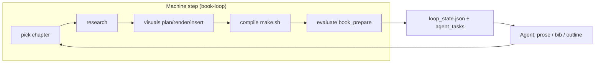

# auto-loops-books

Two autonomous research loops in one repo:

| Loop | Protocol | Mutable surface | Metric |
|------|----------|-----------------|--------|
| **autoresearch-mlx** | [`program.md`](program.md) | `train.py` | `val_bpb` |
| **Loops a Book** (autobooks) | [`program_books.md`](program_books.md) | `books/chapters/*.tex` | `quality_score` |

Both follow [Karpathy's autoresearch](https://github.com/karpathy/autoresearch) pattern: a fixed harness scores each experiment; the agent keeps wins and reverts regressions via git.

**Cloud Agents:** operating manual — [`AGENTS.md`](AGENTS.md) (dual-track PSIVE loop: book content + loops harness; commit/push every round).

---

## Loops a Book — autonomous technical book writing

**Book:** *AI Compiler Performance Engineering* — cross-hardware dataflow kernels, compiler passes, and LLM decode optimization.

**Idea:** Mirror `train.py` + `val_bpb`, but for LaTeX chapters + `quality_score`. A deterministic orchestrator runs research, figures, compile, and evaluation; the coding agent writes prose, citations, and outline changes between steps.

### Architecture



### Quick start

Requirements: Python 3.10+, [uv](https://docs.astral.sh/uv/), LaTeX (`pdflatex`, `bibtex`).

```bash
uv sync

# Optional: live literature search
export SERPAPI_KEY='your-serpapi-key'

# Book progress + next focus chapter
uv run book-loop status

# One machine step (research → visuals → compile → evaluate)
uv run book-loop step

# Bootstrap all OUTLINE chapters (stubs + visuals, no prose expected)
uv run book-loop run --max-steps 5 --bootstrap-only --skip-research

# Build PDF + per-chapter score
cd books && bash make.sh
bash make-chapter.sh ch01          # standalone Chapter 1 PDF → books/pdf/ch01.pdf
bash make-chapter.sh --all         # all chapter PDFs
uv run book_prepare.py --chapter ch01
```

Point a coding agent at [`program_books.md`](program_books.md) and alternate **`book-loop step`** with completing **`agent_tasks`** in [`loops/loop_state.json`](loops/loop_state.json).

**YiRage submodule** (Part VIII runtime chapters):

```bash
git submodule update --init --recursive deps/YiRage
# see deps/README.md
```

### Repository map (autobooks)

| Path | Role |
|------|------|
| [`program_books.md`](program_books.md) | Agent protocol — setup, keep/revert, research, visuals, outline iteration |
| [`book_loop.py`](book_loop.py) / `uv run book-loop` | CLI entry → [`loops/iterate.py`](loops/iterate.py) |
| [`book_prepare.py`](book_prepare.py) | `OUTLINE` rubric + `quality_score` harness (**do not change scoring during loops**) |
| [`research_tools.py`](research_tools.py) | Per-chapter Scholar search → `books/research/<id>/` |
| [`citation_loop.py`](citation_loop.py) | Per-chapter bib (≥25), sentence bindings, strict verify, `\citep` apply |
| [`book_visuals.py`](book_visuals.py) | Figure/table plan, TikZ render, audit |
| [`books/WRITING_STYLE.md`](books/WRITING_STYLE.md) | Unified voice — engineer-narrative; gold standard = ch01 |
| [`books/FACT_VERIFICATION.md`](books/FACT_VERIFICATION.md) | Fact gate — web-verify numbers/examples; `verified_facts.jsonl` + URLs |
| [`AGENTS.md`](AGENTS.md) | Infinite book loop — Fregly alignment, Cloud Agent checklist |
| [`reference-chapter-1.pdf`](reference-chapter-1.pdf) | Fregly style north star (*AI Systems Performance Engineering*, Ch.1 sample) |
| [`book_content.md`](book_content.md) | Chinese outline spec (目录); English output in `.tex` |
| [`books/chapters/*.tex`](books/chapters/) | Mutable manuscript |
| [`books/main.tex`](books/main.tex) | Book skeleton + `\input` order |
| [`book_results.tsv`](book_results.tsv) | Append-only experiment log |
| [`loops/loop_state.json`](loops/loop_state.json) | Last step actions + **`agent_tasks`** for the LLM |

See also: [`loops/README.md`](loops/README.md) (CLI reference), [`books/README.md`](books/README.md) (LaTeX layout).

### `book-loop` commands

```bash
uv run book-loop status [--pick sequential|weakest]
uv run book-loop step [--chapter ch01] [--skip-research] [--research-dry-run] [--skip-compile] [--pick sequential|weakest]
uv run book-loop run --max-steps N [--bootstrap-only] [--skip-research] [--chapter ch01]
uv run book-loop insert-visuals --chapter ch01
uv run book-loop citation-loop --all --crossref-only --apply-tex --merge-bib
uv run citation-loop verify --all
```

| Flag | Meaning |
|------|---------|
| `--pick sequential` (default) | Focus first OUTLINE chapter that fails completion gates (full-book order) |
| `--pick weakest` | Focus highest-backlog incomplete chapter |
| `--bootstrap-only` | Touch each OUTLINE chapter once (stub, research, visuals) |
| `--skip-research` | Skip SerpAPI; still writes keywords/queries if key missing |

### Agent loop (never stop)

1. Read [`books/WRITING_STYLE.md`](books/WRITING_STYLE.md) and skim [`ch01`](books/chapters/ch01_llm_decode_bottlenecks.tex) for tone.
2. Run `uv run book-loop step`.
3. Complete every item in `loops/loop_state.json` → `agent_tasks` (sections, words, citations, bib, visuals).
4. Git **keep** if `quality_score` improved or structural sync succeeded; else **revert** (see `program_books.md`).
5. Repeat until all `OUTLINE` chapters pass gates → extend outline from Chinese spec (ch04+).

### Quality metric

```bash
uv run book_prepare.py --chapter ch01
```

| Component | Weight |
|-----------|--------|
| Section coverage (`OUTLINE` patterns) | 40% |
| Word count (per-chapter band) | 20% |
| Citations (`\citep`/`\citet` in `book.bib`) | 20% |
| `books/make.sh` compile success | 20% |

**Chapter ready** (advance to next chapter): 100% coverage, `min_words`, `min_citations`, no `visual_missing`, compile ok.

### Writing voice

Engineer-narrative, problem-first, hardware↔software bound, multi-hardware (GPU/CPU/NPU/XDNA/AIE). No textbook lecturing. Full rules: [`books/WRITING_STYLE.md`](books/WRITING_STYLE.md).

### Fact verification (mandatory)

Every **numeric claim, vendor spec, or worked example** must be **web-searched and cross-checked** (≥2 query passes) before entering the manuscript. Log primary URLs in `books/research/<chapter_id>/verified_facts.jsonl`; cite with matching `book.bib` / `citations_merged.bib` links. Protocol: [`books/FACT_VERIFICATION.md`](books/FACT_VERIFICATION.md). Unverified numbers stay in `\vispending{}` / TBD only.

**Citation loop (orthogonal to fact gate):** `citation-loop` builds per-chapter `chapter.bib` (≥25 papers), binds claim sentences via chapter keywords, strict-verifies, then `apply` writes `\citep{}` into `build/chapters/*.tex`. Run `merge-bib` before compile.

### Research & visuals (per chapter)

```bash
uv run research_tools.py --chapter ch01 --dry-run   # keywords only
uv run research_tools.py --chapter ch01             # full search (needs SERPAPI_KEY)

uv run book_visuals.py --plan --chapter ch01
uv run book_visuals.py --render --chapter ch01
uv run book_visuals.py --audit --chapter ch01
```

Outputs: `books/research/<id>/` (incl. `verified_facts.jsonl`), `books/visuals/<id>/plan.json`, `books/visuals/<id>/generated/*.tex`.

---

## autoresearch-mlx (Apple Silicon training loop)

Apple Silicon (MLX) port of autoresearch. Full credit to [@karpathy](https://github.com/karpathy) for the core idea.

### Quick start

Requirements: Apple Silicon Mac, Python 3.10+, [uv](https://docs.astral.sh/uv/).

```bash
curl -LsSf https://astral.sh/uv/install.sh | sh   # install uv if needed
uv sync
uv run prepare.py                                  # one-time data + tokenizer prep
uv run train.py                                    # one 5-minute training experiment
```

Point a coding agent at [`program.md`](program.md) and let it run the loop.

### What matters

- `prepare.py` — data prep, tokenizer, dataloader, evaluation. Treat as fixed.
- `train.py` — model, optimizer, training loop. **The file the agent edits.**
- `program.md` — autonomous experiment protocol.
- `results.tsv` — logged experiment history.

### Public baseline results

| Commit | val_bpb | Status | Description |
|---|---:|---|---|
| `383abb4` | 2.667000 | keep | baseline (AdamW, default config) |
| `909dd59` | 2.588904 | keep | halve total batch size to `2^16` |
| `4161af3` | 2.533728 | keep | increase matrix LR to `0.04` |
| `5efc7aa` | 1.807902 | keep | reduce depth from `8` to `4` |

### Differences from upstream

- **MLX instead of PyTorch/CUDA** — native Apple Silicon, unified memory.
- **Smaller eval token budget** — faster iteration on Apple Silicon.
- **Roughly 6–7 minutes per experiment** — 5 min training + compile/eval overhead.
- **MFU reporting is placeholder** — no Apple Silicon H100 FLOPs reference.

---

## Acknowledgments

- [Andrej Karpathy](https://github.com/karpathy) — autoresearch and nanochat
- [scasella/nanochat-mlx](https://github.com/scasella/nanochat-mlx) — MLX GPT reference
- [awni/picochat](https://github.com/awni/picochat) — MLX training patterns
- [Apple MLX team](https://github.com/ml-explore/mlx)
- Deep Learning book notation template — [`books/`](books/) LaTeX style

## License

MIT. See [LICENSE](LICENSE).
