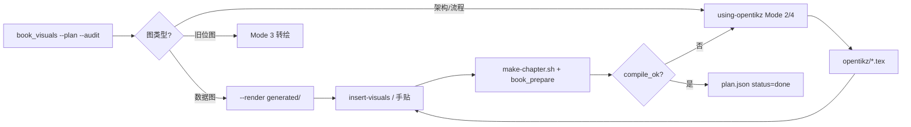

# OpenTikZ 绘图工程化（本书集成手册）

> **Skill**：`using-opentikz`（Cursor：`~/.cursor/skills/using-opentikz/SKILL.md`）  
> **库根目录**：`OTROOT = ~/.cursor/skills/opentikz`（只读；**Mode A** 复制到本书后编辑）  
> **契约**：与 [`AGENTS.md`](../AGENTS.md) §5.6 风格三层循环、[`program_books.md`](../program_books.md) Figures 节联动。

## 一、对本书的核心价值

| 痛点 | OpenTikZ 解法 |
|------|----------------|
| 各章插图画风割裂 | 共享调色板 + 图标库 + 模板 `edit_contract` → 全局可控 |
| 字体/公式与正文不一致 | TikZ 源码嵌入 LaTeX；矢量无缩放失真 → **出版级原生适配** |
| 图难版本化、难与正文同步迭代 | 图形全源码化 → Git diff / 与 Layer 2 Phase 2 同节奏 |
| LLM 直写 TikZ 编译失败率高 | 模板 + `edit_contract` 约束编辑范围 → **编译通过率显著高于裸生成** |
| 商业出版版权 | 内容 **CC0-1.0** → 无授权纠纷 |

与 [`visuals_style.py`](visuals_style.py) 分工：

| 类型 | 工具 | 说明 |
|------|------|------|
| **数据图**（roofline、柱状对比） | `book_visuals.py --render` | 参数来自 `plan.json` + `verified_facts.jsonl`；用 `visPrimary` 等 token |
| **概念/架构图**（流水线、系统框图、编译 Pass 链） | **OpenTikZ** 模板/图标 | 80% 常规插图；`edit_contract` 防结构破坏 |
| **复合图** | OpenTikZ 图标 `\input` + `book_visuals` 布局 | 大图内嵌 `icons/systems/gpu` 等 |

## 二、四种使用模式（全书场景映射）

### Mode 1 — 原子图标复用（无 AI 亦可）

**场景**：架构图中的 GPU、CPU、内存、服务器、注意力模块、队列等通用元素。

**做法**：从 `OTROOT/icons/` 复制 `.tex` 到 `books/visuals/<ch>/opentikz/icons/`，大图内 `\input{...}`。

**本书高频**：

| 路径 | 用途 |
|------|------|
| `icons/systems/gpu`, `cpu`, `disk`, `server`, `queue`, `network` | 硬件 / 服务拓扑 |
| `icons/ml/attention`, `layer`, `model`, `matrix`, `embedding` | 模型 / 算子模块 |

### Mode 2 — 模板编辑（**最高频**；Skill 核心）

**场景**：系统框图、编码器-解码器、推理服务流水线、分布式通信、编译 Pass 链、内存层次。

**机制**：读 `catalog.json` / `template.meta.json` 的 **`edit_contract`** — 仅改 `parameters`、按 `operations` 执行；保留 `invariant` 与 `node_naming`；颜色仅用 `otblue|otorange|otteal|otpurple|otgray`。

**本书模板映射**（`book_visuals` kind → OpenTikZ template id）：

| `plan.json` kind / 章节需求 | OpenTikZ template `id` |
|-----------------------------|------------------------|
| `architecture_figure` | `system-block-diagram` |
| `pipeline_figure`（服务/请求流） | `inference-serving`, `flowchart` |
| 编码器-解码器 / 瓶颈 | `encoder-decoder` |
| 分布式 / 多卡通信 | `distributed-training` |
| 训练 vs 推理对照（少数章） | `training-pipeline` |
| 算子图 / 层堆叠 | `neural-net`, `resnet-block` |
| FlashAttention / 融合专题 | `examples/flash-attention`（example，无 contract 时按 hard rules 改） |

**输出路径**：`books/visuals/<chapter_id>/opentikz/<fig_id>.tex`

### Mode 3 — PNG → TikZ 转绘

**场景**：旧版位图、手绘草稿、外部截图 → 可编辑矢量 + 统一风格。

**流程**：上传 PNG → Skill 识别结构生成初稿 → 人工微调 → 存入 `opentikz/` → `make-chapter.sh` 编译门禁。

**注意**：转绘后必须标注数据来源；数值类元素改引 `verified_facts.jsonl`，禁止臆造 benchmark 柱。

### Mode 4 — 描述生成（从零定制）

**场景**：无现成模板 — YiRage 编译流水线、解码瓶颈拆解、本书专属 co-design 示意图。

**流程**：自然语言描述（模块、流向、标注）→ Skill 基于图标库 + `DESIGN_GUIDE.md` 生成 → 编译验证 → 入库 `opentikz/`。

**门禁**：生成后须通过 `bash make-chapter.sh chXX`；复杂图优先拆为「模板底图 + 图标拼装」降低失败率。

## 三、落地流程（嵌入 Layer 2 Phase 2）

与 §5.6 **Phase 2 内容工程化** 同步：



### 标准命令序列

```bash
# 1. 计划与审计
uv run book_visuals.py --chapter ch01 --plan
uv run book_visuals.py --chapter ch01 --audit

# 2a. 数据类图（roofline / bar）
uv run book_visuals.py --chapter ch01 --render

# 2b. 架构类图 — 激活 using-opentikz Skill（Agent）
#     复制 OTROOT/templates/<id>/template.tex → books/visuals/ch01/opentikz/fig_*.tex
#     按 edit_contract 改标签/模块；latexmk 或 make-chapter.sh 验证

# 3. 插入正文
uv run book-loop insert-visuals --chapter ch01
# 或手贴：\input{visuals/ch01/opentikz/fig_serving_stack.tex}

# 4. 门禁
cd books && bash make-chapter.sh ch01
python3 ../book_prepare.py --chapter ch01
```

### 目录约定

```
books/visuals/<chapter_id>/
  plan.json                 # id, kind, section, label, caption
  generated/                # book_visuals.py 数据图
  opentikz/                 # OpenTikZ 复制件（Git 版本化）
    fig_inference_serving.tex
    icons/                  # 可选：本章复用的原子图标副本
```

正文标记（与现有 AUTO_VISUAL 一致）：

```latex
\label{sec:decode_pain_points}
% AUTO_VISUAL:fig_serving_stack
% OPENTIKZ: inference-serving (edit_contract v1)
\input{visuals/ch01/opentikz/fig_serving_stack.tex}
```

## 四、迭代体系融入

### Layer 1 — 基线

- 在 `WRITING_STYLE.md` §图表 与本文确立：**概念图默认 OpenTikZ 模板族**；数据图默认 `book_visuals` + `visuals_style` token。
- ch01 试点：架构/流水线图优先迁到 `opentikz/`（与 Fregly 对齐样章）。

### Layer 2 — 单章四 Phase

| Phase | OpenTikZ 动作 | 门禁 |
|-------|---------------|------|
| P1 结构 | `plan.json` 拟定 `fig_*` id 与 kind | audit 无缺失 id |
| **P2 工程化** | **主绘图阶段**：Mode 2/3/4 产出 + 表注条件 | □ 核心对比有图 □ 无 Pending |
| P3 风格 | 统一 caption 句式；图题与正文术语一致 | 术语表 |
| P4 校验 | `compile_ok` + checklist | 100% |

**角色**：信息可视化设计师（Agent + `using-opentikz`）主责 P2；QA 用 `book_visuals --audit` + 编译。

### Layer 3 — 全稿收敛 R1

| 动作 | 说明 |
|------|------|
| 调色板 | OpenTikZ 图统一 light Okabe-Ito；或与 `visuals_style` 双色模式（`\Colortrue`）对齐 |
| 图宽 | 单栏 `\resizebox{8.9cm}{!}`（本书 `visuals_style` 单栏 89mm） |
| 编号 | 全书 `fig:` / `tab:` 连续；图题句式统一 |
| 禁止 | 章内混用 matplotlib 截图与 TikZ 同类型架构图 |

## 五、Agent 硬规则（using-opentikz 摘要）

1. **Mode A**：只编辑 `books/visuals/.../opentikz/` 下副本，**永不改 OTROOT**。
2. 模板编辑前 **必读 `edit_contract`**。
3. 颜色：`otblue|otorange|otteal|otpurple|otgray`（或 `!15`  tint）；数据图用 `visPrimary` 等 — **勿混用同一图内两套体系**。
4. 交付前 **必须编译**（`make-chapter.sh` 或 `latexmk -pdf`）。
5. 结尾一行 assumptions summary（Skill §1 要求）。
6. `benchmark_table` / `bar_figure` 数字 **禁止** 在 OpenTikZ 中手写 — 走 `book_visuals` + cite。

## 六、验收 Checklist（插图专项，叠加 §5.6）

| 项 | 标准 |
|----|------|
| □ 来源 | 模板 id / example id 记入 `% OPENTIKZ:` 注释或 commit |
| □ 编译 | 单章 `compile_ok` |
| □ 数据 | 实测柱/点可追溯 `verified_facts.jsonl` 或 `\citep{}` |
| □ 风格 | 与同章其他 TikZ 图调色一致 |
| □ 版权 | 仅 OTROOT CC0 资产或本书原创描述生成 |
| □ 占位 | 无 `placeholder_figure` 残留（除非 plan 明确 pending） |

## 七、维护

```bash
# 更新 OpenTikZ 库（不影响已复制到本书的 tex）
cd ~/.cursor/skills/opentikz && git pull
```

上游：https://github.com/opentikz/opentikz · https://opentikz.org
